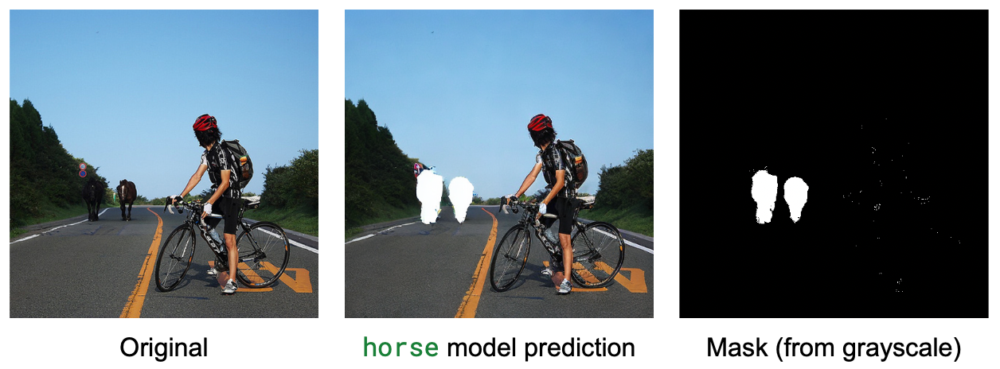

# cocogold: training Marigold for text-grounded object segmentation

[Marigold](https://github.com/prs-eth/Marigold) is a diffusion-based method for depth estimation ([paper](https://hf.co/papers/2312.02145), [demo](https://huggingface.co/spaces/prs-eth/marigold)) that was later extended to other tasks, such as normals estimation ([paper](https://hf.co/papers/2505.09358), [demo](https://huggingface.co/spaces/prs-eth/marigold-intrinsics)). I always wondered if a similar method could be applied to segmentation, which has some differences compared with the tasks Marigold was designed for. I've been working on it as an on-off side project, and here's my report (TL;DR: I trained a proof of concept model, and it works 😎)

I love Marigold because it shows how to cleverly leverage an existing open model ([Stable Diffusion](https://huggingface.co/stabilityai/stable-diffusion-2)) and fine-tune it for a different task. Because Stable Diffusion was trained on a vast amount of images, its _image understanding_ capabilities are fantastic. By reusing this rich image representation knowledge, Marigold can be fine-tuned in just a few days using a single consumer GPU. Stable Diffusion is an excellent choice, because most of the computation happens in _latent space_ instead of working directly with the image pixels. Latent space is a fancy way to say that we are able to compress the input images by a big factor (`48`, in this case), and therefore computations are much faster and require a lot less memory.

However, Marigold uses Stable Diffusion (SD) just as a vision backbone, completely ignoring that SD is equally capable of understanding _text_ that describes visual content. This is because depth or normals computation are pure computer vision tasks. Unlike Stable Diffusion, which was designed to generate an image based on a text description, Marigold generates an image (the depth map) using the original image as the input to the model. This is akin to image-to-image generation tasks, but we only need an input image – text descriptions are not required.

The question I wanted to solve is: what if we could use a similar method to estimate segmentation masks, using text to describe the object we want to find?


Turns out we can! I worked on a proof-of-concept as a side project. I used the COCO dataset for simplicity, and reused the Marigold method with some tweaks. My side project was thus born as `cocogold`.

## What does cocogold do?

As shown in the elephant image above, cocogold is able to estimate a segmentation mask from an arbitrary object in an image, using text to specify the object we are interested in. Not all images are as easy as that one, though. Sometimes the subject we want to extract is not a big fat elephant taking most of the photo. Consider the following examples taken from the validation set we used in our training run (we are displaying the masks as white areas overlapped on the image, for reasons we'll describe later):


As you can see, it works for non-salient objects in the photo, including small and partially ocluded ones. Amazingly, it also generalizes to unseen classes – the model was never trained to recognize elephants, but as you can see in the first example of this post, it was able to do it!

> [!NOTE]
> This is just an experimental proof-of-concept, not a SOTA segmentation method. But it's a super effective and interesting way to leverage image generation models for text-grounded computer vision tasks!

## How does it work?

To see how cocogold works, let's see how it differs from Marigold.

### The Marigold Method

Marigold is based on the Stable Diffusion UNet, which is one of the models that comprise the Stable Diffusion pipeline. In Stable Diffusion, the UNet works with two inputs: a noisy input image, and a text prompt. The UNet's job, conceptually, is to predict a less noisy input image. It's designed to work in a loop: starting from pure gaussian noise, it progressively carves an image out of the noise, using the text description as a guide towards the result we want.

<figure class="image text-center">
  
  <figcaption> Denoising process for prompt <i>"Portrait painting of Pedro Cuenca looking happy"</i>. Disclaimer: I'm not that person. </figcaption>
</figure>

Marigold uses a modified UNet:
- Text input is ignored.
- Instead of text + image, it accepts two images as input. The first image is the original one from which we want to estimate the depth map. Instead of the text prompt, this is what's used to condition and guide the generation process. The second image is the noisy one: we start with pure Gaussian noise, and the model gradually predicts a depth map, using the original image as the reference.

### cocogold

The cocogold pipeline is conceptually very simple – but, as usual, the devil is in the details. For training, we'll use three inputs:

- The text input that specifies the object to segment. The original Stable Diffusion UNet was prepared to work with text, so we just need to pass the text inputs that Marigold ignores.
- The original image.
- The segmentation mask from the COCO dataset that we'll use as the ground truth.

#### Dataset Preparation

To prepare the training dataset, I downloaded the original COCO dataset and converted the _panoptic_ segmentation masks (every pixel in the image is assigned one of the supported classes) to object segmentation (we are only interested in pixels that match a given class). Then I wrote [a simple library](https://github.com/pcuenca/cocogold) that does the following:

- Retrieve an image and a class.
- Obtain the segmentation mask corresponding to the class.
- Randomly crop a square for easier training.
- Apply some simple heuristics to avoid masks that are heavily cut out after applying the random crop, and to assign a larger priority to larger masks.

I wrapped this in a PyTorch `Dataset` class. Every time you iterate through the dataset you'll get different crops and masks, so I didn't bother with additional augmentations during training.

I wrote this library using [nbdev](https://nbdev.fast.ai), so you can follow the process in detail in the [exploration notebook](https://github.com/pcuenca/cocogold/blob/main/nbs/coco-semantic.ipynb).

#### Training

Training was done with [this fork of Marigold](https://github.com/pcuenca/marigold), in which I applied the modifications explained above and created a specific training script. The code is ugly, as I hardcoded most of what I needed without worrying about keeping compatibility with Marigold. Furthermore, I forked it a few months ago and never synced with their codebase again. I have worked on this for maybe 5 or 6 days total, but the process spanned several weeks because I only came back to it once in a while.

What's more interesting than my poor engineering practices is that my first training run didn't work.


The training run looked promising: after just a few steps, I was getting reasonable masks. However, training for longer didn't improve results, and I saw lots of degenerate cases and objects that failed to be recognized at any step throught the process. I had a few guesses about why this was happening:

- The model was being trained to predict just two values: background (shown as black), and mask. In most training cases, one takes more area than the other – usually it's the background that's larger than the subject to segment. Since I was using MSE as my loss function, I thought that maybe the model was learning to predict the most frequent value to minimize loss.

[!NOTE]  
This is only true at the conceptual level, as MSE loss is computed in latent space, not comparing the decoded pixels. But still, the dataset samples were imbalanced, even in latent space.

- I suspected that some objects are usually small, and the model may learn that, for example, "banana" always refers to something small. I did not fully verify if this was consistent.
- The dataset also had a strong class imbalance, with the `person` class being overrepresented. This is an analysis of one full iteration over the full training dataset (remember that samples are random, so the numeric values are not necessarily exact):


So training for longer could potentially be overfitting to `person` subjects. I should have conducted this analysis earlier :(

To address the first issue, I explored tweaking my loss function to make it more difficult for the model to pick the majority class. Turns out there's been research in this area (of course), and people use _class weighting_ or _focal loss_ for this purpose. But these methods make sense for pixel space, and I didn't want to compute loss with pixels – to do that, I would have to decode the latents to convert them to images, and that's costly and takes a lot of memory. I wrote a very naïve focal loss function for latent space, but it also didn't work.

#### Fixing it

After fighting with loss functions for a while, it suddenly dawned on me that the fix could be much simpler! Instead of forcing an scenario where the model has to learn to choose between two values, I realized I was in control of the data and could prepare inputs differently. Instead of providing the binary segmentation mask as the ground truth, I drew the mask on top of the original image. This is way more natural for a model that was trained for millions of steps to generate images composed of pixels, and has rarely encountered binary masks before!

In addition to this, I also restricted the training classes to the following:

```py
valid_categories = [
    "car", "dining table", "chair", "train", "airplane",
    "giraffe", "clock", "toilet", "bed", "bird",
    "truck", "cat", "horse", "dog",
]
```

I excluded the heavily overrepresented `person` class, and kept the top-14 remaining classes.

With these changes in place, training progressed nicely with the results you see [at the beginning](#what-does-cocogold-do). The model learned to predict almost-exact copies of the images given as input, except it used white blocks to signal the object we are interested in segmenting.

#### How long does it take?

One of the advantages of using a laser-focused method like Marigold is that iteration is fast, because we leverage a model that knows a lot about image representation and learns new tasks very quickly. I trained for about 40 hours (~18,000 steps) on a single A6000 Ada GPU – this is like a 4090, but with 48 GB of RAM instead of 24. Results were pretty good in just ~5,000 steps, but I kept training for longer and saving intermediate checkpoints because I wanted to test at various stages later on.

I used `float32`, no LoRA. Training could potentially be much faster, but I didn't want to introduce uncertainty during this initial experimentation phase.

#### Post-processing for Inference

We are not done yet. We successfully created a model that does _not_ predict a segmentation mask, but a segmentation mask (in white color), on top of an image. We actually need to create a binary segmentation mask from the predicted image, because that's what we need for downstream tasks.

To create the segmentation mask, my approach was to filter the output to keep white-ish pixels and discard the rest. We have to filter with a certain tolerance because the model does not predict a perfect `1.0` pixel for every pixel in the mask, but something like `0.997` or `0.935`. This has a problem, however: real images also contain white pixels. It's rare that they are pure white (all channels close to `1.0`), but if you've ever seen a photo shot in the sun with an overblown white-ish sky, the chances to find white pixels are not neglibible. To illustrate the issue, this is a typical result when selecting white-ish pixels:



As you can see, there are several white pixel outliers in unrelated places.

To solve this problem, I resorted to old-school image processing algorithms that are still super useful. For this case of small outlier blotches, we can use an _erosion_ operation (pixels are replaced by the majority class of nearby pixels, removing noise), followed by _dilation_ (we expand shapes by adding pixels to the boundaries). This results in more or less the same shapes, with outliers removed. I did this with a small 3×3 convolution kernel, but you can achieve the same thing with pooling. This is the post-processed mask with outliers gone:


[!NOTE]  
Erosion and dilation are part of a family of _morphological operations_. The combination of erosion followed by dilation is also known as _morphological opening_. You don't need to know these names, unless you find them in papers or something.

In hindsight, I should have selected a different color for the masks. A pure green color like the one used for chroma keys in video sets could probably work – if it's good enough for TV it should be ok for training, right? Perhaps I could quickly fine-tune the model to replace the color and see if it works without having to post-process the mask.

#### Generalization

As mentioned before, the model was never trained for classes such as `elephant`, yet it works. This is a testament to the powerful representations of images and text achieved during the original training of Stable Diffusion; we don't have to do anything and it just works. Actually, I found it interesting that very early model checkpoints with few training steps were able to predict very good masks, but were poor at generalization. Training for longer reaches a point when generalization works. I don't have a clear intuition as to why this should be the case.

## Dude, why not just use VLMs?

VLMs (Vision-Language Models) combine a "vision understanding" model with an LLM, so they can generate text based on what they see in the images we present them and the questions we ask. They [are becoming a general-purpose solution](https://huggingface.co/blog/vlms-2025) to address a multitude of tasks, including visual question answering, OCR, captioning, and many others.

My intuition regarding VLMs is that they can certainly work for segmentation, as [PaliGemma](https://huggingface.co/collections/google/paligemma-2-mix-67ac6a251aaf3ee73679dcc4) [demonstrated](https://huggingface.co/blog/paligemma). However, PaliGemma used _a lot_ of data during pre-training to learn geometry-aware tasks. Imbuing a generic VLM with enough knowledge to perform segmentation would probably require substantially more data and time than we spent on this experimental training run. In addition, VLMs can only output text, so you need to account for that during training: add new tokens to the model, initialize them properly, create something (a custom VAE) to encode/decode them.

I think diffusion models are easier because they already know about all of this stuff, so training is fast and straightforward. But it'd be cool to compare!

There's also the option to use regular segmentation models, but then the challenge is to make them respond adequately to text. It’s [certainly possible](https://github.com/IDEA-Research/GroundingDINO), but you have to carefully design your text encoding, alignment, detection and segmentation pipeline.

## Summary of resources

- [COCO dataset with instance segmentation data](https://huggingface.co/datasets/ariG23498/coco2017) that can be used for binary segmentation.
- [Library to iterate through the dataset](https://github.com/pcuenca/cocogold), generating random crops and masks.
- [Training code, forked from Marigold](https://github.com/pcuenca/Marigold/tree/cocogold).
- [Final model trained](https://huggingface.co/pcuenq/marigold-coco-segmentation).
- [Intermediate checkpoints](https://huggingface.co/pcuenq/marigold-coco-segmentation/tree/refs%2Fpr%2F1/checkpoint), they live in a branch of the previous repo.

### What's next

There are a few things I still haven't done that would be cool to complete:

- Evaluate the model using a segmentation metric like IoU, to see how good it actually is. I just wanted to explore whether we could train a text-grounded segmentation model with diffusion, but I have no idea how it performs.
- Measure how good the model is on classes we used during training vs classes we didn't use.
- Train with more classes.
- Ensembling during inference. Since the diffusion process is stochastic, results are slightly different each time you run inference. The original Marigold for depth estimation uses the median (or average) of a few predictions, but I haven't tested this yet on this task.
- Improve text understanding by using synonyms or varied phrases, instead of just the COCO class name. Better yet, we could use a VLM to create a short caption for the desired object and train with that. During inference, we could give instructions using descriptions like "please, select the girl that is closest to the door". This should improve generalization, and is super cool.
